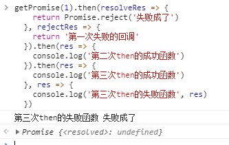

### Promise是一个类，这个类的构造函数接收一个函数fn作为参数，函数fn接收两个参数，第一个是函数fn执行成功时所需要执行的，第二个是失败时所需要执行的。
```javascript
  // 下面这个函数new一个promise对象，并将它返回
  function getPromise(num){
    return new Promise(function(resolve, reject){
      // 如果new的时候返回的数字为1，就返回成功
      if(num === 1)
        resolve('成了')
      else
        reject('没成')
    })
  }
```

Promise.prototype.then(onFulfilled, onRejected)：这个函数用来定义对上一步返回的promise对象要做的进一步的操作，then函数接收两个函数作为参数，第一个是上一步执行resolve时要执行的函数onFulfilled，第二个函数式上一步执行reject时要执行的函数onRejected。
#### 这个函数返回一个新的Promise对象，并且会通过此次then函数中执行的结果来设置新的Promise对象的状态和状态处理函数对应的参数。
```javascript
  getPromise(1).then(resolveRes => {
    console.log(resolveRes)
    return '第一次成功的回调'
  }, rejectRes => {
    console.log(rejectRes)
    return '第一次失败的回调'
  }).then(resolveRes => {
    console.log(resolveRes)
    return '第二次成功的回调'
  }, rejectRes => {
    console.log(rejectRes)
    return '第二次失败的回调'
  }).then(resolveRes => {
    console.log(resolveRes)
  }, rejectRes => {
    console.log(rejectRes)
  }).catch(e => {
    console.log('执行失败', e)
  })
```

then函数的几条规则：
  1. 如果then中的回调函数返回一个值，那么then返回的Promise将会成为接受状态，并且将返回的值作为接受状态的回调函数的参数值。
```javascript 
  getPromise(2).then(resolveRes => {
    console.log(resolveRes)
    return '第一次成功的回调'
  }, rejectRes => {
    console.log(rejectRes)
    return '第一次失败的回调'
  })
  /*
    从上面可以看出，即使then函数中执行了onRejected的函数，但是then仍然会返回一个resolved状态的promise对象，并且这个把onRejected函数的返回值作为下一次then函数的onFulfilled函数的参数。
  */
```


  2. 如果then中的回调函数没有返回值，那么then返回的Promise将会成为接受状态，并且该接受状态的回调函数的参数值为 undefined。
  3. 如果then中的回调函数抛出一个错误，那么then返回的Promise将会成为拒绝状态，并且将抛出的错误作为拒绝状态的回调函数的参数值。
```javascript
  // 当promise对象返回resolve，并且在then的onFulfilled函数中抛出异常
  getPromise(1).then(resolveRes => {
    console.log(resolveRes)
    throw new Error('测试抛出错误')
    return '第一次成功的回调'
  }, rejectRes => {
    console.log(rejectRes)
    return '第一次失败的回调'
  })
  // 通过运行结果可以看出，在onFulfilled函数中抛出异常的话，then函数会返回一个状态为reject的promise对象，并且会把异常作为下一次then函数的onRejected函数的参数。
```

  4. 如果then中的回调函数返回一个已经是接受状态的Promise，那么then返回的Promise也会成为接受状态，并且将那个Promise的接受状态的回调函数的参数值作为该被返回的Promise的接受状态回调函数的参数值。
```javascript
  getPromise(1).then(resolveRes => {
    console.log(resolveRes)
    return Promise.resolve('成了')
  }, rejectRes => {
    console.log(rejectRes)
    return '第一次失败的回调'
  })
```

  5. 如果then中的回调函数返回一个已经是拒绝状态的Promise，那么then返回的Promise也会成为拒绝状态，并且将那个Promise的拒绝状态的回调函数的参数值作为该被返回的Promise的拒绝状态回调函数的参数值。
```javascript
  getPromise(1).then(resolveRes => {
    console.log(resolveRes)
    return Promise.reject('失败成了')
  }, rejectRes => {
    console.log(rejectRes)
    return '第一次失败的回调'
  })
  // 通过运行结果可以看出，当then返回一个Promise.reject对象的时候，如果后续没有then对这个状态进行处理的话，系统就会抛出一个错误。
```

```javascript
  // 测试越过多层then对reject进行处理
  getPromise(1).then(resolveRes => {
    return Promise.reject('失败成了')
  }, rejectRes => {
    return '第一次失败的回调'
  }).then(res => {
    console.log('第二次then的成功函数')
  }).then(res => {
    console.log('第三次then的成功函数')
  }, res => {
    console.log('第三次then的失败函数', res)
  })
  // 通过结果可以看出，如果在某一级发生了reject或者error，错误将被传向下一个then，如果下一个then没有，就继续向下传递，直到有then存在onRejected函数，如果一直then都没有存在onRejected函数，那就在最后找catch函数
```


#### catch() 方法返回一个Promise，并且处理拒绝的情况。它的行为与调用Promise.prototype.then(undefined, onRejected) 相同。

#### finally() 方法返回一个Promise，在promise执行结束时，无论结果是fulfilled或者是rejected，在执行then()和catch()后，都会执行finally指定的回调函数。
```javascript
  getPromise(1).then(resolveRes => {
    return Promise.reject('失败成了')
  }, rejectRes => {
    return '第一次失败的回调'
  }).then(res => {
    console.log('第二次then的成功函数')
  }).catch(e => {
    console.log('catch中异常打印', e)
    return '传给finally'
  }).finally(msg => {
    console.log(msg)
  })
  // 通过运行结果可以看出，catch中的`return '传给finally'`语句并没有把strin传给finally函数，finally函数中打印msg参数为undefined，这是因为 由于finally函数无法知道promise的最终状态，所以finally的回调函数中不接收任何参数，它仅用于无论最终结果如何都要执行的情况。
```


Promise.all(iterable)：这个函数可以对多个Promise对象进行检查，如果参数中  promise 有一个失败（rejected），此实例回调失败（reject），失败原因的是第一个失败 promise 的结果，如果都返回成功就返回一个成功的数组。
```javascript
  let promise1 = Promise.resolve(3);
  let promise2 = 42;
  let promise3 = new Promise(function(resolve, reject) {
    setTimeout(resolve, 100, 'foo');
  });

  Promise.all([promise1, promise2, promise3]).then(function(values) {
    console.log(values);
  });
```

```javascript
  let promise1 = Promise.reject(3);
  let promise2 = 42;
  let promise3 = new Promise(function(resolve, reject) {
    setTimeout(resolve, 100, 'foo');
  });

  Promise.all([promise1, promise2, promise3]).then(function(values) {
    console.log(values);
  });
  // 从结果中可以看出，只返回了reject状态的参数，并且系统抛出了异常
```
