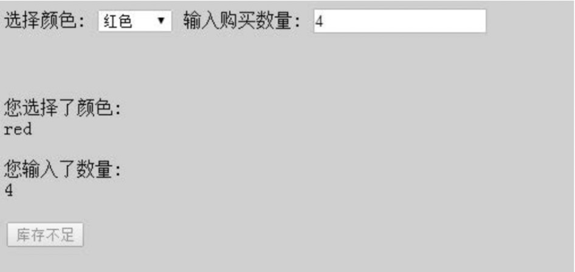
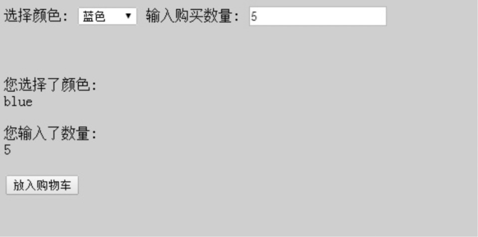
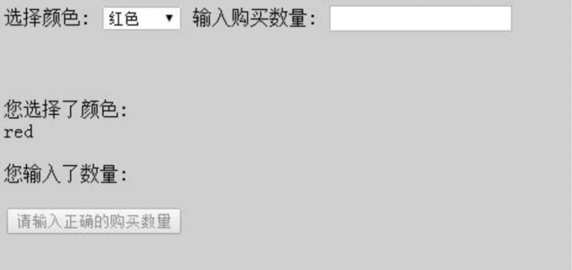

### 中介者模式
当程序的规模增大的时候，产生的对象也会越来越多，对象之间的关系错综复杂，经常会形成多对多的关系，这也就导致了当改变或者删除一个对象的时候，经常需要修改与他相关的所有对象。中介者模式就是用来解决这个问题，在多个对象中增加一个中介者之后，所有相关对象都通过中介者来通信，而不是相互引用，这样当一个对象发生改变的时候，不需要通知其他任何对象，其他对象要获取值的时候也不需要访问这个对象。这就使得各个对象之间耦合松散，而且对象可以独立修改自己的内容。

也就是说在vue中，如果有多个组件之间有比较频繁的交互的时候，可以开一个中间组件来协调各个组件之间的传值。

需求：假设我们正在编写一个手机购买的页面，在购买流程中，可以选择手机的颜色以及输入购买 数量，同时页面中有两个展示区域，分别向用户展示刚刚选择好的颜色和数量。还有一个按钮动 态显示下一步的操作，我们需要查询该颜色手机对应的库存，如果库存数量少于这次的购买数量， 按钮将被禁用并且显示库存不足，反之按钮可以点击并且显示放入购物车。
选择红色手机，购买 4 个，库存不足：

选择蓝色手机，购买 5 个，库存充足，可以加入购物车。

或者是没有输入购买数量的时候，按钮将被禁用并显示相应提示。

我自己的实现方式：[上面的需求](./zhongjiezhe/me.html)
注：虽说上面的代码有些冗余，但是已经基本上完成了上面的功能，并且将select下拉框选择的值和input输入的值进行判断，但是在开始检查的时候，将两个元素的值的检查都放在了一个函数中，看起来有点笨重。

#### 现在如果页面上不需要展示颜色和输入的数量的话，那就需要删除showColor和showNumber函数被使用的地方，还有如果再给手机新添加一个内存的限制，那么就需要添加元素属性，而且要修改相应的checkCanPut和checkSelectChange函数，基本上所有的代码都需要动一遍，这大概就是传说说中的牵一发而动全身，现在看一下使用中介者模式的是怎么写和怎么解决这些问题的。

