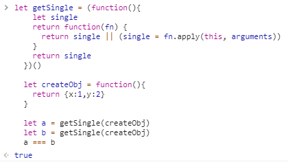

单例模式：保证一个类仅有一个实例，并提供一个访问它的全局访问点。
单例模式代码：
```javascript
  (function createSingleton(){
    let singleton
    return function (CreateObj) {
      if(!singleton){
        singleton = new CreateObj()
      }
      return singleton
    }
  })()
```
惰性单例是指在需要的时候才创建对象实例。
```javascript
  let getSingle = (function(){
    let single
    // fn即为创建单例对象的那个函数
    return function(fn) {
      // 这里的fn函数不需要返回一个实例，只需要返回一个非空值即可
      return single || (single = fn.apply(this, arguments))
    }
    return single
  })()

  let createObj = function(){
    return {x:1,y:2}
  }

  let a = getSingle(createObj)
  let b = getSingle(createObj)
  a === b
```
### 运行结果：

### 单例模式适用场景：在只需要初始化一次，但是会被调用很多次的情况下。