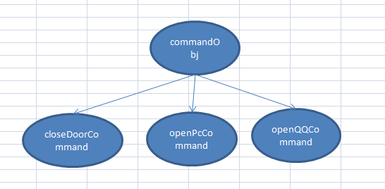

### 命令模式
应用场景：有时候需要向某些对象发送请求，但是又不知道请求的接受者是谁，也不知道请求的接收者需要做什么操作，这个时候需要在发送者和接受者之间有一种低耦合的关系，就需要使用命令模式。

命令模式实例：
```javascript
  // 每一个命令接收对象都需要暴露出一个execute方法来被执行
  let closeDoorCommand = {
    execute: function(){
      console.log('关门')
    }
  }

  let openPcCommand = {
    execute: function(){
      console.log('开门')
    }
  }

  let openQQCommand = {
    execute: function(){
      console.log('登录QQ')
    }
  }

  // 指令缓存对象，用来记录并且执行请求者发送的所有指令
  function createCommand(){
    return {
      commandsList: [],
      add: function(command){
        this.commandsList.push(command)
      },
      execute: function(){
        this.commandsList.forEach(item => {
          item.execute()
        })
      }
    }
  }

  // 通过命令模式，下面请求者无需关心指令具体如何实现，只需要添加自己需要的指令，并且执行即可。
  // 创建一个指令缓存对象
  let commandObj = createCommand()
  // 添加调用者所有想要执行的指令
  commandObj.add(closeDoorCommand)
  commandObj.add(openPcCommand)
  commandObj.add(openQQCommand)
  //执行所有指令
  commandObj.execute()
```

### 组合模式
是用于把一组相似的对象当作一个单一的对象，使得用户对单个对象和组合对象的使用具有一致性，同时它将整个对象组合成树形结构，以表示"部分-整体"的层次结构。

组合模式的树形结构：
研究命令模式的例子可以看出来，不管是指令缓存的对象，还是每一个指令都会暴露出一个execute函数，不同的是每一个指令没有add方法。由此我们可以把这个调用模式理解为一个树形结构：
由上图可以看出，每一条命令都是从树的顶端发出的，然后一直向下执行，直到遇到叶子节点，也就是每一条指令，然后执行完指令再继续遍历，整个过程相当于对整棵树进行了一次深度优先遍历。
[树形模式实例](./zuhe/zuhetest.html)
从上面的例子可以看出，基本对象可以被组合成更复杂的对象，组合对象又可以被组合，这样不断递归下去。但是对于请求者而言，只需要调用顶层的execute方法就可以了。